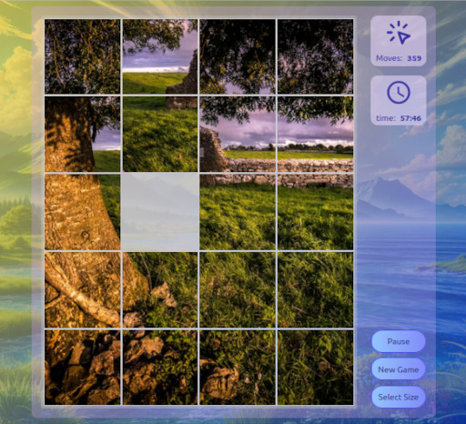

# PicsPuzzle React Game

PicsPuzzle is a puzzle game where the player has to move puzzle pieces to reveal a picture.



## Play Now

Want to play the game ?...   
A live deployment of this game is available at   
**https://pics-puzzle.audaxland.net**

## Build with React & TailwindCss

This game is build using
[React](https://reactjs.org/){:target="_blank"} 
with [create-react-app](https://create-react-app.dev/){:target="_blank"} 
and [TailwindCss](https://tailwindcss.com/){:target="_blank"}, 
and also uses 
[react-router-dom](https://reactrouter.com/en/main){:target="_blank"} 
and [react-icons](https://react-icons.github.io/react-icons/){:target="_blank"}  
  
The Pictures are mostly taken from [Unsplash](https://unsplash.com/){:target="_blank"}

The Icons, though imported via react-icons originate from: 
[Ionicons](https://ionic.io/ionicons){:target="_blank"},
[Bootstrap](https://github.com/twbs/icons){:target="_blank"},
[Tabler Icons](https://github.com/tabler/tabler-icons){:target="_blank"} and 
[Font Awesome](https://fontawesome.com/){:target="_blank"}


## Run the game locally

### `git clone https://github.com/audaxland/picsPuzzleReact` 

Clone the repository and run npm install with the commands

```bash
git clone https://github.com/audaxland/picsPuzzleReact
cd picsPuzzleReact
npm install
```

### `npm start`

Runs the app in the development mode.\
Open [http://localhost:3000](http://localhost:3000) to view it in your browser.

The page will reload when you make changes.\
You may also see any lint errors in the console.

### `npm run build`

Builds the app for production to the `build` folder.\
It correctly bundles React in production mode and optimizes the build for the best performance.

The build is minified and the filenames include the hashes.\
Your app is ready to be deployed!
